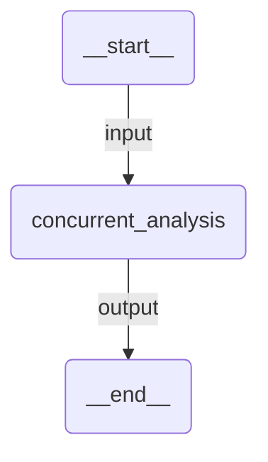

# Concurrent

Three specialist agents analyze the same input text in parallel: sentiment analysis, topic extraction, and summarization. Results are aggregated automatically.

## Agent Graph



Internally, the concurrent orchestration fans out to:
- **sentiment** — analyzes positive/negative/neutral sentiment
- **topic_extractor** — identifies topics, entities, and themes
- **summarizer** — writes a concise summary

All three run simultaneously, results are collected and returned together.

## Run

```
uipath run agent '{"messages": [{"contentParts": [{"data": {"inline": "Apple announced a new Vision Pro headset today, priced at $3,499. The mixed-reality device features a custom M4 chip and will be available in 10 countries. Analysts are divided on whether the high price point will limit adoption."}}], "role": "user"}]}'
```

## Debug

```
uipath dev web
```
