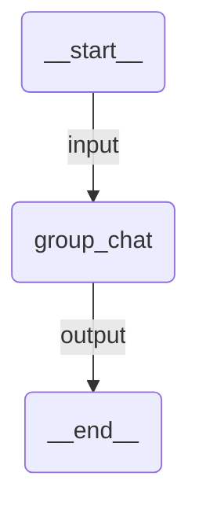

# Group Chat

A group discussion where multiple agents (researcher, critic, writer) take turns in a shared conversation. An orchestrator agent selects who speaks next based on the discussion flow.

## Agent Graph



Internally, the group chat orchestration manages:
- **researcher** — finds facts via Wikipedia
- **critic** — challenges claims and asks probing questions
- **writer** — synthesizes the discussion into clear prose
- **orchestrator** — picks the next speaker each round

## Run

```
uipath run agent '{"messages": [{"contentParts": [{"data": {"inline": "What are the environmental impacts of lithium mining?"}}], "role": "user"}]}'
```

## Debug

```
uipath dev web
```
