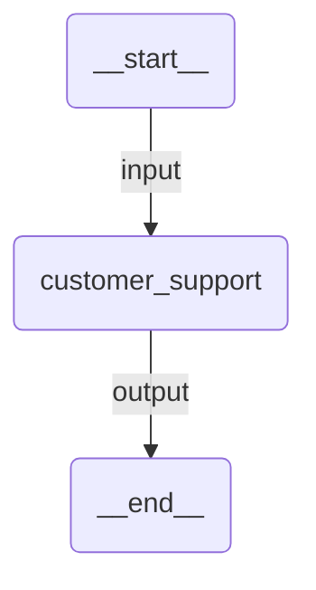

# Handoff

A customer support system where agents transfer control to each other based on the customer's needs. The triage agent routes to specialists, and specialists can re-route if needed.

## Agent Graph



Internally, the handoff orchestration manages routing between:
- **triage** — first contact, routes to the right specialist
- **billing_agent** — invoices, payments, charges
- **tech_agent** — bugs, errors, technical setup
- **returns_agent** — product returns and refunds

Agents hand off control using auto-generated `handoff_to_<agent>` tools. When an agent hands off, it steps out and the target agent takes over the conversation directly.

## Run

```
uipath run agent '{"messages": [{"contentParts": [{"data": {"inline": "Hi, I was charged twice for my last order"}}], "role": "user"}]}'
```

## Debug

```
uipath dev web
```
