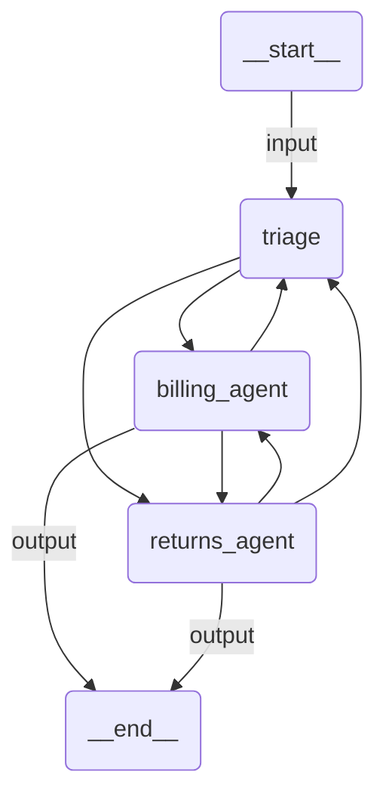

# HITL Workflow

A customer support workflow with human-in-the-loop approval for sensitive operations. A triage agent routes requests to billing or returns specialists. Both `transfer_funds` and `issue_refund` tools require human approval before executing.

## Agent Graph



## Prerequisites

Authenticate with UiPath to configure your `.env` file:

```bash
uipath auth
```

## Run

```
uipath run agent '{"messages": [{"contentParts": [{"data": {"inline": "I need a refund for order #12345"}}], "role": "user"}]}'
```

## Debug

```
uipath dev web
```
