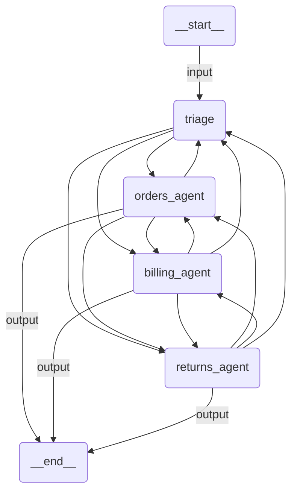

# HITL Workflow

A customer support workflow with human-in-the-loop approval for sensitive operations. A triage agent routes requests to specialists: billing handles fund transfers, returns handles refunds. The `transfer_funds`, `get_customer_order`, and `issue_refund` tools all require human approval before executing.

## Agent Graph



## Prerequisites

Authenticate with UiPath to configure your `.env` file:

```bash
uipath auth
```

## Run

Try a refund request (triggers `get_customer_order` + `issue_refund`, both require approval):

```
uipath run agent '{"messages": [{"contentParts": [{"data": {"inline": "I need a refund for order #12345, the item was defective"}}], "role": "user"}]}'
```

Or a fund transfer (triggers `transfer_funds`, requires approval):

```
uipath run agent '{"messages": [{"contentParts": [{"data": {"inline": "Transfer $500 from account ACC-001 to account ACC-002"}}], "role": "user"}]}'
```

## Debug

```
uipath dev web
```
