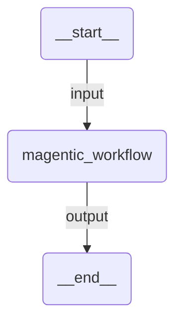

# Magentic

A multi-agent orchestration based on the Magentic-One pattern. A dedicated manager dynamically coordinates specialized agents (researcher and analyst), selecting who acts next based on task progress and context.

## Agent Graph



Internally, the magentic orchestration manages:
- **researcher** — finds facts via Wikipedia
- **analyst** — analyzes data and draws conclusions
- **magentic_manager** — plans, selects the next agent, and tracks progress

The manager dynamically selects which agent should act next based on the evolving context.

## Prerequisites

Authenticate with UiPath to configure your `.env` file:

```bash
uipath auth
```

## Run

```
uipath run agent '{"messages": [{"contentParts": [{"data": {"inline": "Compare the environmental impacts of solar and wind energy production"}}], "role": "user"}]}'
```

## Debug

```
uipath dev web
```
