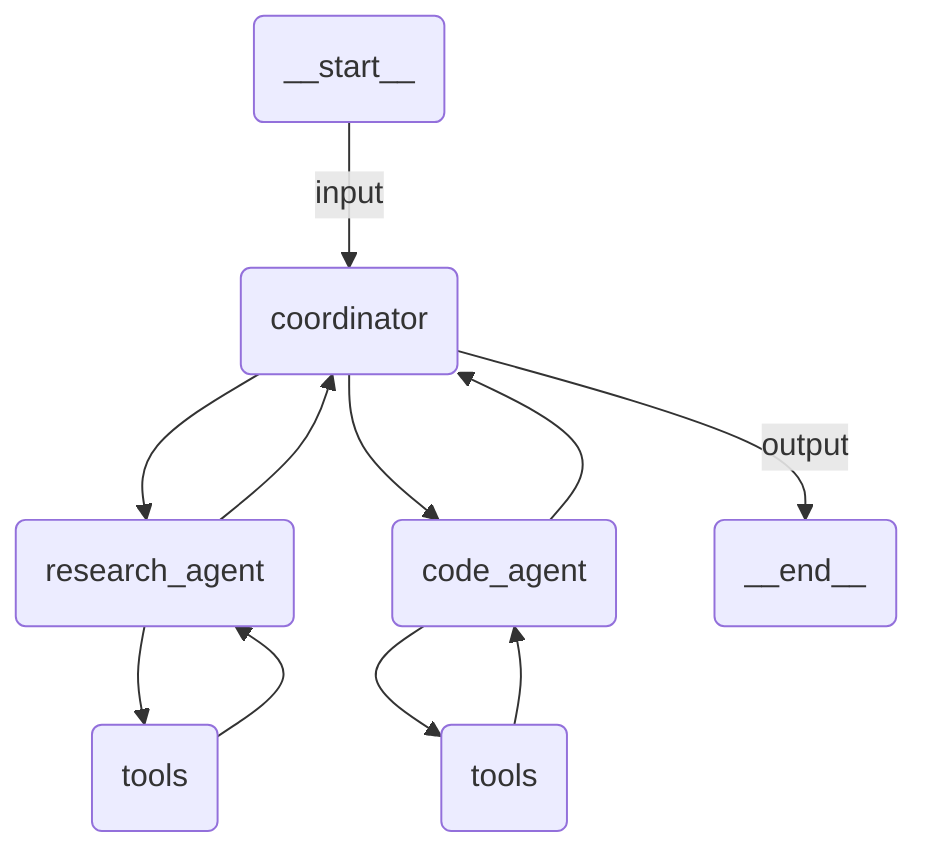

# Multi-Agent

A coordinator agent that delegates to specialist agents (research + code execution) using the Agent Framework's `as_tool()` pattern.

## Agent Graph



## Prerequisites

Authenticate with UiPath to configure your `.env` file:

```bash
uipath auth
```

## Run

```
uipath run agent '{"messages": [{"contentParts": [{"data": {"inline": "What is the population of France and calculate its square root?"}}], "role": "user"}]}'
```

## Debug

```
uipath dev web
```
