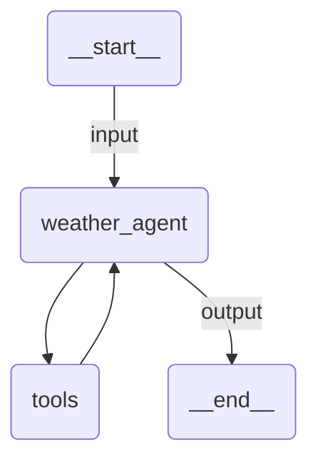

# Quickstart Agent

A simple weather assistant that fetches current weather data for any location using the Open-Meteo API. Uses LLMs through the UiPath LLM Gateway.

## Agent Graph



## Run

```
uipath run agent '{"messages": [{"contentParts": [{"data": {"inline": "What is the weather in San Francisco?"}}], "role": "user"}]}'
```

## Debug

```
uipath dev web
```
