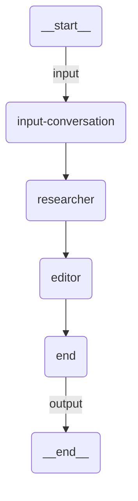

# Sequential + Structured Output

A sequential pipeline that combines multi-agent processing with structured output. A researcher gathers facts about a city, then an editor organizes them into a well-defined Pydantic model (`CityInfo`). The final output is a typed JSON object — not free-form text.

## Agent Graph



Internally, the sequential orchestration chains:
- **researcher** — gathers key facts about the city (country, population, landmarks, cultural significance)
- **editor** — organizes the research into a structured `CityInfo` schema with `response_format`

Each agent sees the full conversation history from previous agents. The last agent's `response_format` determines the output schema.

## Prerequisites

Authenticate with UiPath to configure your `.env` file:

```bash
uipath auth
```

## Run

```
uipath run agent '{"messages": [{"contentParts": [{"data": {"inline": "Tell me about Tokyo"}}], "role": "user"}]}'
```

## Debug

```
uipath dev web
```
