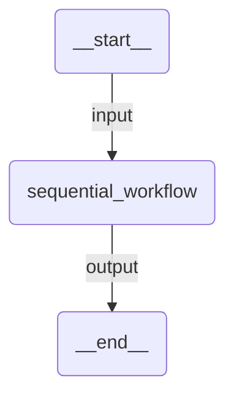

# Sequential

A sequential pipeline where agents process a task one after another. A writer creates marketing copy, a reviewer provides feedback, and an editor produces the polished final version.

## Agent Graph



Internally, the sequential orchestration chains:
- **writer** — creates an initial marketing paragraph
- **reviewer** — provides constructive feedback on the draft
- **editor** — incorporates feedback and produces the final polished version

Each agent sees the full conversation history from previous agents.

## Prerequisites

Authenticate with UiPath to configure your `.env` file:

```bash
uipath auth
```

## Run

```
uipath run agent '{"messages": [{"contentParts": [{"data": {"inline": "Write a tagline for a budget-friendly eBike"}}], "role": "user"}]}'
```

## Debug

```
uipath dev web
```
