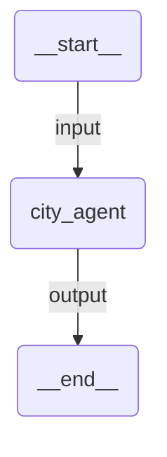

# Structured Output

A simple workflow agent that returns structured data using a Pydantic model. The agent extracts city information (name, country, description, population, and notable features) and returns it in a well-defined JSON schema.

## Agent Graph



## Prerequisites

Authenticate with UiPath to configure your `.env` file:

```bash
uipath auth
```

## Run

```
uipath run agent '{"messages": [{"contentParts": [{"data": {"inline": "Tell me about Tokyo"}}], "role": "user"}]}'
```

## Debug

```
uipath dev web
```
