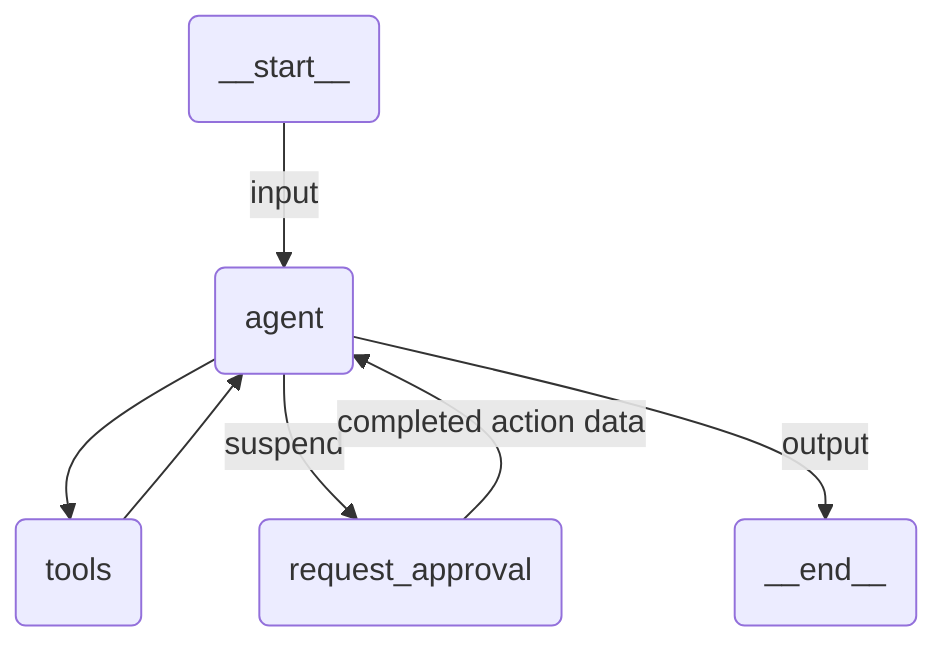

# Action Center HITL Agent

A Claude Agent SDK agent that raises an Action Center action for a human and suspends the job until that action is completed.

## Overview

Nothing UiPath-specific is injected. The developer writes an ordinary SDK tool and calls `interrupt()` inside it with a `CreateTask` imported from `uipath.platform.common`:

```python
from uipath.platform.common import CreateTask
from uipath_claude_sdk import interrupt, uipath_tool_server

ESCALATION_APP = "generic_escalation_app"
ESCALATION_FOLDER = "Shared"


@tool("request_approval", "...", {"report_id": str, "question": str})
async def request_approval(args: dict[str, Any]) -> dict[str, Any]:
    action_data = await interrupt(
        CreateTask(
            title=f"Expense approval {args['report_id']}",
            data={"AgentName": "Expense agent", "AgentOutput": args["question"]},
            app_name=ESCALATION_APP,
            app_folder_path=ESCALATION_FOLDER,
        )
    )
    ...


approvals_server = uipath_tool_server("approvals", tools=[request_approval])
```

Passing a `CreateTask` is what makes this a TASK resume trigger. The platform decides the trigger kind from the value's type, so switching this agent to a job, a timer or an Integration Services event is a matter of passing a different model, with no other change.

The app name and the folder are deployment configuration, so they are module constants. The model never sees them, and the system prompt describes the agent's job rather than the escalation plumbing.

`book_expense` needs no suspension, so it stays in a normal `create_sdk_mcp_server`. Only tools that can call `interrupt()` belong in a `uipath_tool_server`.

Nothing is held open in memory: the process ends, the action sits in Action Center for as long as it takes, and the run continues in a fresh process once a human has worked it. The completed action's data arrives at the agent as the result of the very call that was parked, so the model keeps its full context instead of being re-prompted.

## Prerequisites

- An Action Center app named `generic_escalation_app` in the `Shared` folder, with the `AgentName` and `AgentOutput` fields and an `Answer` output field. Change `ESCALATION_APP`, `ESCALATION_FOLDER` and the `data` keys in `main.py` to match your own app.
- Nothing else. The action is created by the platform from the suspend value, so the agent needs no Orchestrator client of its own.

## How it works

1. The input is validated against `ExpenseReport` and the `prompt` template renders the user message
2. The system prompt tells the agent to escalate every report, so it calls `mcp__approvals__request_approval` with the report id and a question
3. A `PreToolUse` hook runs the tool body. `interrupt()` raises out of it carrying the `CreateTask`, the hook records the pending suspension against the call's `tool_use_id` and defers the call, and the run ends as SUSPENDED with that model as its output
4. UiPath turns it into a TASK resume trigger and creates the action in Action Center
5. A human opens the action, answers, and completes it
6. On resume the runtime rebuilds the hook, re-attaches to the same Claude session and runs the body again. This time `interrupt()` returns the completed action's data, the body maps it to the decision the model reads, and that return value is delivered as the parked call's tool result
7. The agent calls `book_expense` or refuses, and the result is validated against `ExpenseDecision`

The body runs twice across a suspension, exactly as a LangGraph node does. Anything before the `interrupt()` call happens on both passes, so keep side effects after it or make them idempotent.

## Agent graph



## Tools

| Tool                              | Description                                                            |
| --------------------------------- | ---------------------------------------------------------------------- |
| `mcp__approvals__request_approval` | Raises an Action Center action and suspends until a human completes it |
| `mcp__expenses__book_expense`      | Books the expense, only after the human approved it                    |

## Input / Output

```json
// Input
{
  "report_id": "EXP-2291",
  "employee": "Dana Petrescu",
  "amount": 1840.5,
  "category": "Travel",
  "justification": "Flights and hotel for the customer workshop in Munich."
}

// Output
{
  "approved": true,
  "booked_amount": 1840.5,
  "summary": "..."
}
```

## Running the agent

**Initial run (creates the action and suspends):**
```bash
uipath run agent --file input.json
```

The run ends as SUSPENDED. Open Action Center, work the action, and complete it.

**Resume once the action is completed:**
```bash
uipath run agent --resume
```

The resume needs no payload. A TASK trigger is pollable, so the runtime reads the completed action itself and hands its data to the re-run body.

## Key features

- **Opt-in, not injected**: the agent has exactly the tools it declares, and the escalation lives in the developer's own tool
- **Durable suspension**: the job can end between the escalation and the human's decision
- **No new prompt on resume**: the action data comes back as the parked tool call's result
- **The platform model picks the trigger**: `CreateTask` means TASK, and any other model from `uipath.platform.common` works the same way with no change here
- **Structured output**: input and output are Pydantic models, validated on both ends

## Assigning the action

`CreateTask` also accepts `assignee` (an email address) or a `recipient` object for group, workload or round-robin routing, plus `priority` and `labels`. Set them in the tool body, from a tool argument when the agent should choose the routing.
