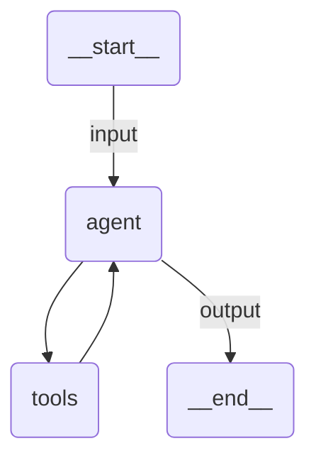

# Chat Agent

A multi-turn Claude Agent SDK agent that answers questions about meeting rooms. One exchange per
invocation, with the conversation carried across invocations by the runtime rather than by anything
in the agent.

## Overview

The only thing that makes this a chat agent is one line in `uipath.json`:

```json
{
  "runtimeOptions": {
    "isConversational": true
  }
}
```

`uipath init` writes it, the factory reads it at startup, and the conversational runtime is selected
instead of the standard one. `main.py` is an ordinary `UiPathClaudeAgent` with one in-process tool and
a system prompt. Nothing in it knows it is conversational: no `input_schema`, no `output_schema` and no
`prompt` template, because in this mode input and output are the UiPath conversation message format
rather than the agent's own.

The agent is honest about its limits. It reads a fixed room list and suggests the smallest room that
fits, and it says plainly that it cannot book, hold or cancel anything, or tell you who is using a room
when. There is nothing behind it that could.

## How an exchange works

1. The runtime pulls the newest user message out of the conversation input, whether it arrives as the
   first invocation's `messages` or wrapped in the `{interrupt_id: payload}` map a resume carries
2. It re-attaches to the stored Claude session id, so the CLI continues the same conversation rather
   than starting a new one
3. The assistant's text is streamed as UiPath conversation message events (message start,
   content-part chunks, message end); tool calls and thinking stay state events
4. The Claude session id and the CLI's session transcript are stored, then the exchange ends
   **suspended on nothing**. The suspension keeps the job and its state alive for the next message;
   carrying no interrupt is what tells a chat host the turn is over

That last part matters. A suspension that carries an interrupt is a turn still owed an answer, and a
chat host keeps the exchange open until it gets one. A finished turn has nothing outstanding, so it
suspends empty, and the host closes the exchange and unlocks the composer.

Every exchange after the first therefore arrives as a resume. That is the runtime's own mechanism for
waiting, and it is unrelated to `interrupt()`: this agent registers no `uipath_tool_server`, so it never
parks a tool call. Add one and both kinds of suspension coexist, an interrupt inside an exchange and the
plain wait between exchanges.

The workspace directory is keyed on the conversation, not on the invocation, so a file the agent writes
in one turn is still there in the next.

## Agent graph



## Tools

| Tool         | Description                                                        |
| ------------ | ------------------------------------------------------------------ |
| `find_rooms` | Lists the rooms seating at least a given headcount (fixed sample data) |

## Input / Output

Input is a UiPath conversation message. Only the newest user message is sent to the model; everything
earlier is already in the Claude session.

```json
// input.json
{
  "messages": [
    {
      "role": "user",
      "contentParts": [
        {
          "mimeType": "text/plain",
          "data": { "inline": "I need a room for 6 people ..." }
        }
      ]
    }
  ]
}
```

The assistant's reply comes back as conversation message events on the stream. The exchange's result is
always `SUSPENDED`, and on a finished turn its output is empty:

```json
{
  "output": {},
  "status": "suspended"
}
```

## Running the agent

**With a UiPath tenant.** As written, `uipath_llm=UiPathModel("claude-sonnet-4-5")` routes every model
call through the UiPath LLM Gateway.

```bash
uv sync
uv run uipath auth
uv run uipath init
uv run uipath run agent --file input.json                      # first message
uv run uipath run agent --file next_message.json --resume      # second message
```

**Without a tenant.** Delete the `uipath_llm=` line from `main.py` and export an Anthropic key. Nothing
UiPath-specific is injected then, and the two commands above are unchanged.

```bash
uv sync
export ANTHROPIC_API_KEY=sk-ant-...
uv run uipath init
uv run uipath run agent --file input.json
uv run uipath run agent --file next_message.json --resume
```

`next_message.json` deliberately asks the agent to recall something only the first turn established:

```
Remind me which room you suggested and what the meeting was called.
```

A correct answer names Beehive and the Kingfisher review. Both come from turn one, so an answer that
has them is proof the second message reached the model *and* that the Claude session was resumed. A
reply that asks what you are talking about means one of the two did not happen.

The terminal will not show you that answer. `uipath run` renders state events, which is why the tool
calls and the model's thinking appear, and the assistant's text is a conversation message event, which
a chat host consumes and the console does not print. Read it in the session transcript instead:

```bash
python3 -c "
import glob, json, os
path = max(glob.glob('__uipath/claude_home/projects/*/*.jsonl'), key=os.path.getsize)
for line in open(path):
    message = json.loads(line).get('message') or {}
    content = message.get('content')
    if isinstance(content, str):
        print('you >', content)
    for block in content if isinstance(content, list) else []:
        if block.get('type') == 'text':
            print('agent >', block['text'])
"
```

Keep going with a third message by editing `next_message.json` and repeating the `--resume` command.
The conversation only ends when you stop resuming it.

## What persists between turns

Look inside `__uipath/` between two invocations:

- `state.db` holds the Claude session id and the CLI's session transcript, plus any interrupt an
  exchange is parked on
- `claude_home/projects/*/*.jsonl` is the CLI's own transcript of the conversation

Only the state database is guaranteed to survive on the platform, which is why the transcript is copied
into it and restored on the far side.

## Key features

- **One config flag**: `runtimeOptions.isConversational` is the whole opt-in. The agent code is unchanged
- **Real session continuity**: the SDK re-attaches to the same Claude session, so history is the CLI's,
  not a message list this runtime replays
- **Durable between turns**: the process can end between two messages
- **Stable workspace**: files the agent writes survive from one exchange to the next
- **Streaming text**: assistant text arrives as UiPath conversation message events, ready for a chat host
