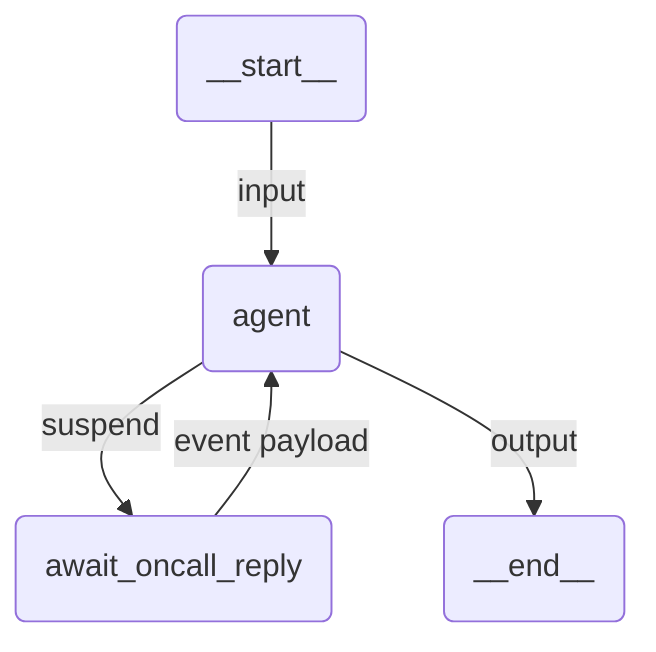

# Integration Event Agent

A Claude Agent SDK agent that escalates an incident and suspends until a remote event, such as a Slack message or a Teams reply, is delivered through Integration Services.

## Overview

Nothing UiPath-specific is injected. The agent declares one tool of its own, and that tool calls `interrupt()` with a `WaitIntegrationEvent` imported from `uipath.platform.common`:

```python
from uipath.platform.common import WaitIntegrationEvent
from uipath_claude_sdk import interrupt, uipath_tool_server

CONNECTOR = "uipath-slack"
CONNECTION_NAME = "Slack-OnCall"
OPERATION = "OnMessage"
OBJECT_NAME = "Message"
FILTER_EXPRESSION = "channel == 'oncall'"


@tool("await_oncall_reply", "...", {})
async def await_oncall_reply(args: dict[str, Any]) -> dict[str, Any]:
    event = await interrupt(
        WaitIntegrationEvent(
            connector=CONNECTOR,
            connection_name=CONNECTION_NAME,
            operation=OPERATION,
            object_name=OBJECT_NAME,
            filter_expression=FILTER_EXPRESSION,
        )
    )
    ...


oncall_server = uipath_tool_server("oncall", tools=[await_oncall_reply])
```

Passing a `WaitIntegrationEvent` is what makes this an INBOX resume trigger. The platform decides the trigger kind from the value's type.

The connection details are module constants rather than tool arguments, because they are deployment configuration: the connector key, the operation and the object name come from the connector's own event catalogue and differ per connector and per tenant. The model is told to wait for a reply, not how the tenant is wired.

## Prerequisites

**This sample is not runnable on a bare tenant.** It needs a configured Integration Services connection, and the constants at the top of `main.py` are placeholders. Edit them to match your tenant:

- `CONNECTOR` is the connector key, for example `uipath-slack`
- `CONNECTION_NAME` is the name of a connection you have already created in Integration Service, resolved to its connection id when the trigger is created. Set `connection_folder_path` too when the connection lives outside the run's folder
- `OPERATION` and `OBJECT_NAME` name an event the connector actually publishes. Take them from the connector's event triggers, do not guess
- `FILTER_EXPRESSION` narrows which events wake the run, and is optional

Nothing sends the escalation message itself. The agent only waits. Post the message from a connector activity, a flow, or a person, and the sample handles the reply.

## How it works

1. The input is validated against `EscalationRequest` and the `prompt` template renders the user message
2. The agent calls `mcp__oncall__await_oncall_reply`
3. A `PreToolUse` hook runs the tool body. `interrupt()` raises out of it carrying the `WaitIntegrationEvent`, the hook records the pending suspension against the call's `tool_use_id` and defers the call, and the run ends as SUSPENDED with that model as its output
4. UiPath resolves the connection name to a connection id, generates an inbox id and creates an INBOX resume trigger
5. When the connector delivers a matching event, the job resumes. The runtime rebuilds the hook, re-attaches to the same Claude session and runs the body again. This time `interrupt()` returns the event payload, and the body's return value is delivered as the parked call's tool result
6. The agent reads the reply and the result is validated against `EscalationOutcome`

An INBOX trigger is not pollable. Unlike a task or a job, there is nothing to check, so the run stays suspended until the event is pushed to it.

The body runs twice across a suspension, exactly as a LangGraph node does. Anything before the `interrupt()` call happens on both passes, so keep side effects after it or make them idempotent.

## Agent graph



## Tools

| Tool                              | Description                                                       |
| --------------------------------- | ------------------------------------------------------------------ |
| `mcp__oncall__await_oncall_reply` | Suspends until Integration Services delivers a matching event       |

## Input / Output

```json
// Input
{
  "incident": "Checkout latency above 2s for the last 15 minutes in eu-west-1."
}

// Output
{
  "acknowledged": true,
  "responder": "...",
  "next_step": "...",
  "summary": "..."
}
```

## Running the agent

**Initial run (subscribes to the event and suspends):**
```bash
uipath run agent --file input.json
```

**Resume when the event arrives:**

Deployed, the resume is automatic. Integration Services delivers the event to the trigger's inbox and the job continues on its own.

Locally there is no delivery, so feed a payload by hand to see the rest of the run:
```bash
uipath run agent '{"user": "alex", "text": "I am on it, rolling back the last deploy."}' --resume
```

That payload is what `interrupt()` returns inside the tool body, exactly as a delivered event would be, which makes it a usable way to test the agent's handling of the reply without a live connector.

## Key features

- **Durable suspension on a remote event**: the job holds nothing open while it waits for the outside world
- **No new prompt on resume**: the event payload comes back as the parked tool call's result
- **Connection resolved by name**: the platform maps `connection_name` to the connection id, so the agent carries no ids
- **Opt-in, not injected**: the wait lives in the developer's own tool, and the platform model passed to `interrupt()` picks the trigger kind
- **Structured output**: input and output are Pydantic models, validated on both ends
