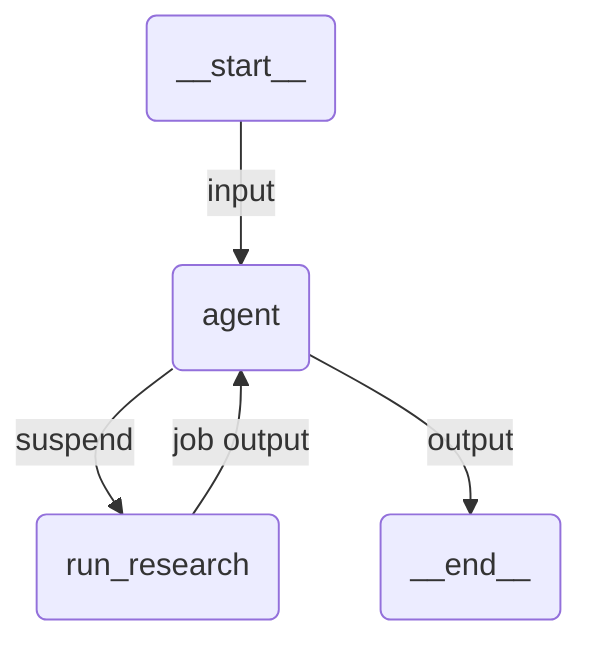

# Multi Agent

A Claude Agent SDK agent that hands the work to another Orchestrator process and suspends until that job finishes, then writes the briefing from its output.

## Overview

Nothing UiPath-specific is injected. The agent declares one tool of its own, and that tool calls `interrupt()` with an `InvokeProcess` imported from `uipath.platform.common`:

```python
from uipath.platform.common import InvokeProcess
from uipath_claude_sdk import interrupt, uipath_tool_server

RESEARCH_PROCESS = "company-research-agent"
RESEARCH_FOLDER = "Shared"


@tool("run_research", "Research a topic and return the findings.", {"topic": str})
async def run_research(args: dict[str, Any]) -> dict[str, Any]:
    output = await interrupt(
        InvokeProcess(
            name=RESEARCH_PROCESS,
            input_arguments={"topic": args["topic"]},
            process_folder_path=RESEARCH_FOLDER,
        )
    )
    return {"content": [{"type": "text", "text": json.dumps(output, default=str)}]}


research_server = uipath_tool_server("research", tools=[run_research])
```

`InvokeProcess` is what makes this a JOB resume trigger. The platform decides the trigger kind from the value's type.

To the model this is just a tool called `run_research` that takes a topic and returns findings. The process name and the folder are deployment configuration and stay module constants, so the model never has to reason about Orchestrator at all. That is what makes the delegation swappable: point the constants at a different process and the agent does not change.

The invoked process can be anything Orchestrator runs, including another coded agent, an RPA process or a low-code agent, so this is how one agent delegates to another without either of them knowing how the other is built.

> **Warning:** an agent can invoke itself. Guard against that with an exit condition in the prompt or the input, because a process that keeps invoking itself never terminates.

## Wait for any, not wait for all

Pass a **list** to `interrupt()` and it becomes sibling resume triggers under one interrupt id. The run wakes as soon as the **first** of them fires, and the others are deleted. That is a property of the suspend value, not of any particular tool, so the same trick waits for the first of several Action Center actions, or the first of several already running jobs:

```python
first = await interrupt([CreateTask(...), CreateTask(...)])
```

Each turn suspends at most once, so a tool body can wait for a set of things but never for two independent interrupts.

## How it works

1. The input is validated against `BriefingRequest` and the `prompt` template renders the user message
2. The agent calls `mcp__research__run_research` with the topic
3. A `PreToolUse` hook runs the tool body. `interrupt()` raises out of it carrying the `InvokeProcess`, the hook records the pending suspension against the call's `tool_use_id` and defers the call, and the run ends as SUSPENDED with that model as its output
4. UiPath turns it into a JOB resume trigger and starts the process
5. On resume the runtime rebuilds the hook, re-attaches to the same Claude session and runs the body again. This time `interrupt()` returns the job output, and the body's return value is delivered as the parked call's tool result
6. The agent writes the briefing and the result is validated against `Briefing`

The body runs twice across a suspension, exactly as a LangGraph node does. Anything before the `interrupt()` call happens on both passes, so keep side effects after it or make them idempotent.

## Agent graph



## Tools

| Tool                          | Description                                                            |
| ----------------------------- | ---------------------------------------------------------------------- |
| `mcp__research__run_research` | Starts the research process and suspends until its job finishes         |

## Input / Output

```json
// Input
{
  "topic": "UiPath"
}

// Output
{
  "report": "...",
  "sources": ["..."]
}
```

## Running the agent

The process named by `RESEARCH_PROCESS` in `main.py` must be published to the folder named by `RESEARCH_FOLDER`. It is expected to take a `topic` input argument and to return the research as its job output. Change both constants to point at your own process.

**Initial run (starts the job and suspends):**
```bash
uipath run agent --file input.json
```

**Resume once the job has finished:**
```bash
uipath run agent --resume
```

The resume needs no payload. A JOB trigger is pollable, so the runtime reads the finished job itself and hands its output to the re-run body.

## Key features

- **Delegation across projects**: the invoked process can be any Orchestrator process, coded or low-code
- **Opt-in, not injected**: the delegation lives in the developer's own tool, with the schema and the result mapping they chose
- **The model sees a capability, not plumbing**: the process, the folder and Orchestrator itself stay out of the prompt
- **Wait for any**: a list passed to `interrupt()` becomes sibling triggers resolved by the first to fire
- **Structured output**: input and output are Pydantic models, validated on both ends
