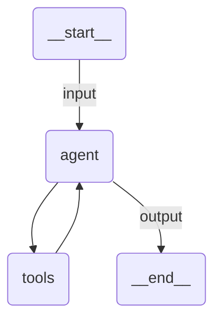

# Quickstart Agent

A Claude Agent SDK agent that converts an amount between two currencies by calling one deterministic in-process tool, and returns structured output.

## Overview

The agent is declared as a `UiPathClaudeAgent`. Passing `uipath_llm=UiPathModel("claude-sonnet-4-5")` is the explicit opt-in that routes every LLM call through the UiPath LLM Gateway, so no Anthropic API key is needed. Leave `uipath_llm` unset and the Claude Agent SDK talks to Anthropic directly with whatever credentials it finds.

The model id is resolved against the tenant's model discovery at startup, so a friendly name such as `claude-sonnet-4-5` is enough. There is no need to know how the tenant hosts the model.

## How it works

1. The input is validated against `ConversionRequest` and the `prompt` template renders the user message
2. The runtime resolves the model, starts the local gateway shim, and points the Claude Code CLI at it
3. The agent loop calls `get_exchange_rate`, which is served in process through `create_sdk_mcp_server`, so no external MCP process is started
4. The result is validated against `ConversionResult`

## Agent graph



## Tools

| Tool                | Description                                                    |
| ------------------- | -------------------------------------------------------------- |
| `get_exchange_rate` | Returns the rate between two ISO currency codes (sample rates) |

## Input / Output

```json
// Input
{
  "amount": 100,
  "from_currency": "EUR",
  "to_currency": "RON"
}

// Output
{
  "converted_amount": 495.45,
  "rate_used": 4.9545,
  "explanation": "..."
}
```

## Running the agent

```bash
uv run uipath auth
uv run uipath init
uv run uipath run agent --file input.json
```

## Key features

- **Explicit gateway opt-in**: `uipath_llm` decides whether traffic goes to the tenant or straight to Anthropic
- **Model discovery**: a friendly model id is resolved to the id the tenant actually serves
- **In-process tool**: a deterministic `@tool` served by an SDK MCP server, so runs are reproducible
- **Structured output**: input and output are Pydantic models, validated on both ends
