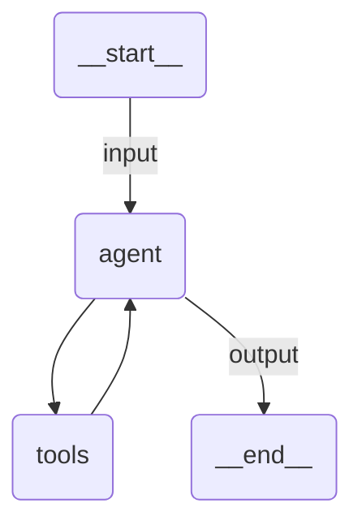

# Quickstart Agent

A currency conversion assistant built with the Claude Agent SDK. Demonstrates a custom in-process tool (SDK MCP server) and structured output (`output_format` json_schema). LLM calls route through the UiPath LLM Gateway.

## Agent Graph



## Run

```
uipath auth
uipath init
uipath run agent '{"input": "Convert 100 EUR to RON"}'
```

## Debug

```
uipath dev
```
