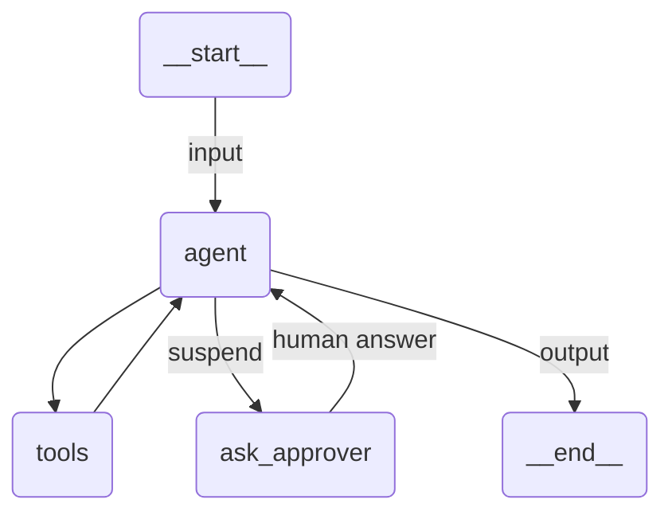

# Simple HITL Agent

A Claude Agent SDK agent that suspends durably and waits for a human before it refunds an order.

## Overview

Nothing UiPath-specific is injected into this agent. The developer writes two ordinary SDK tools, and one of them, `ask_approver`, calls `interrupt()`:

```python
@tool("ask_approver", "Ask a human a question and wait for their answer.", {"question": str})
async def ask_approver(args: dict[str, Any]) -> dict[str, Any]:
    answer = await interrupt(args["question"])
    return {"content": [{"type": "text", "text": json.dumps(answer, default=str)}]}


approvals_server = uipath_tool_server("approvals", tools=[ask_approver])
```

`uipath_tool_server` returns a plain `McpSdkServerConfig`, registered in `mcp_servers` like any other. `issue_refund` needs no suspension, so it stays in a normal `create_sdk_mcp_server`.

The value handed to `interrupt()` decides the resume trigger. Here it is a plain string, which the platform turns into an API trigger, so this sample runs with no tenant at all.

The suspension is durable. The process may end and the machine may go away: the run resumes in a fresh process, and the human's answer arrives at the agent as the result of the very call that was parked, so the conversation continues where it stopped rather than starting over.

## How it works

1. The input is validated against `RefundRequest` and the `prompt` template renders the user message
2. The system prompt tells the agent to ask before refunding, so it calls `mcp__approvals__ask_approver` with a question
3. A `PreToolUse` hook runs the tool body. `interrupt()` raises out of it, the hook records the pending suspension against the call's `tool_use_id` and defers the call, and the run ends as SUSPENDED with the question as its output
4. UiPath turns that question into an API resume trigger
5. On resume the runtime rebuilds the hook, re-attaches to the same Claude session and runs the body again. This time `interrupt()` returns the human's answer, the body completes, and its return value is delivered as the parked call's tool result
6. The agent then calls `issue_refund` or refuses, and the result is validated against `RefundOutcome`

The body runs twice across a suspension, exactly as a LangGraph node does. Anything before the `interrupt()` call happens on both passes, so keep side effects after it or make them idempotent.

## Agent graph



## Tools

| Tool                          | Description                                                     |
| ----------------------------- | --------------------------------------------------------------- |
| `mcp__approvals__ask_approver` | Suspends the run until a human answers the question              |
| `mcp__refunds__issue_refund`   | Records the refund, only after the human approved it             |

## Input / Output

```json
// Input
{
  "order_id": "ORD-4711",
  "amount": 249.99,
  "reason": "The package arrived damaged."
}

// Output
{
  "approved": true,
  "refunded_amount": 249.99,
  "summary": "..."
}
```

## Running the agent

**Initial run (suspends and waits for approval):**
```bash
uipath run agent '{"order_id": "ORD-4711", "amount": 249.99, "reason": "The package arrived damaged."}'
```

**Resume with the human response:**
```bash
uipath run agent '{"response": "yes"}' --resume
```

Whatever JSON you pass on resume is what `interrupt()` returns inside the tool body.

## Key features

- **Opt-in, not injected**: the agent has exactly the tools it declares. Drop `uipath_tool_server` and it is an ordinary Claude Agent SDK agent again
- **Durable suspension**: the job can end between the question and the answer, nothing is held open in memory
- **No new prompt on resume**: the answer comes back as the parked tool call's result, so the model keeps its full context
- **Your tool, your contract**: the question, the tool's schema and the shape handed back to the model are all the developer's choice
- **Structured output**: input and output are Pydantic models, validated on both ends
