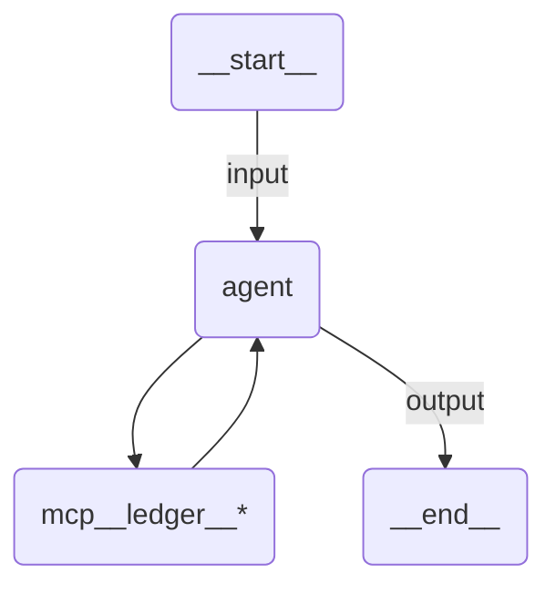

# Simple Local MCP Agent

A Claude Agent SDK agent that runs its own MCP server as a local subprocess over stdio, and returns structured output.

## Overview

`ledger_server.py` is a stdio MCP server holding an in-memory expense ledger. The Claude Code CLI starts it with the command and arguments given in `mcp_servers`, keeps it alive for the run, and exposes its tools to the model as `mcp__ledger__*`.

The agent is told to record each expense line through the server and to read the total back from it rather than adding the numbers itself, so the arithmetic is deterministic and the model only does the parsing and the wording.

A stdio server is a plain subprocess, so the config is just how to launch it:

```python
mcp_servers={
    "ledger": {
        "type": "stdio",
        "command": sys.executable,
        "args": [str(LEDGER_SERVER)],
    }
}
```

`sys.executable` is the interpreter running the agent, which is the one that already has the dependencies. The path is derived from `__file__` because the working directory of a published run is not the sample directory.

`ledger_server.py` imports only `mcp`, which the Claude Agent SDK already depends on, so nothing extra has to be installed. Log lines go to stderr because stdout carries the MCP protocol.

## Stdio, SDK, or remote

| Transport | When it fits |
| --------- | ------------ |
| `stdio` (this sample) | An existing MCP server binary or script, its own process and dependencies, restarted per run |
| `sdk` (`create_sdk_mcp_server`, see the quickstart agent) | Tools you write in the agent module itself, no subprocess |
| `http` / `sse` (see the remote MCP agent) | A server someone else hosts, including UiPath-hosted ones |

## Validating the mapping

The runtime adds no MCP server of its own, so every entry in `mcp_servers` is one you wrote. The key `uipath` is still refused at startup. Call `uipath_claude_sdk.mcp.validate_mcp_servers(...)` on the mapping to catch that, and a malformed entry, when the module is imported rather than when the run starts.

## How it works

1. The input is validated against `ExpenseReport` and the `prompt` template renders the user message
2. The runtime resolves the model, starts the local gateway shim, and points the Claude Code CLI at it
3. The CLI spawns `ledger_server.py` and lists its tools
4. The agent calls `add_entry` once per line, then `total` and `largest_entry`
5. The result is validated against `ExpenseSummary`

## Agent graph



## Tools

| Tool            | Description                                          |
| --------------- | ---------------------------------------------------- |
| `add_entry`     | Records one expense under a label                    |
| `list_entries`  | Returns every recorded expense                       |
| `total`         | Returns the sum of every recorded expense            |
| `largest_entry` | Returns the label of the most expensive entry        |

## Input / Output

```json
// Input
{
  "expenses": [
    "Flight to Bucharest: 412.30",
    "Hotel, three nights: 268.00",
    "Taxi from the airport: 34.50",
    "Team dinner: 156.75"
  ],
  "currency": "EUR"
}

// Output
{
  "total": 871.55,
  "largest": "Flight to Bucharest",
  "explanation": "..."
}
```

## Running the agent

```bash
uv run uipath auth
uv run uipath init
uv run uipath run agent --file input.json
```

## Key features

- **Local stdio MCP server**: a real subprocess, launched and torn down by the CLI
- **Deterministic arithmetic**: the total comes from the server, not from the model
- **No extra dependencies**: the server uses `mcp`, which the Claude Agent SDK already brings
- **Structured output**: input and output are Pydantic models, validated on both ends
