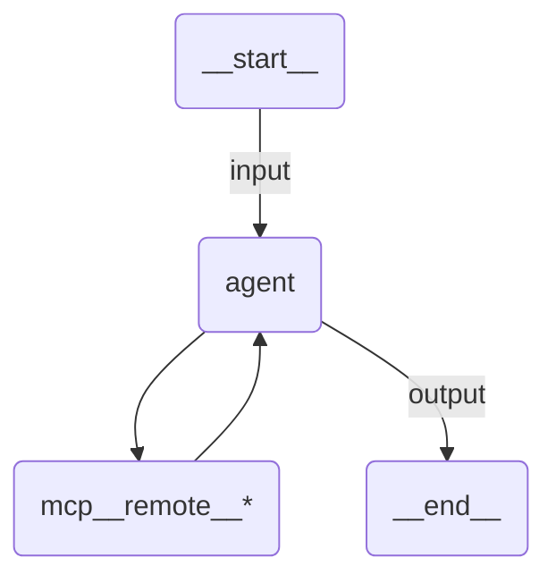

# Simple Remote MCP Agent

A Claude Agent SDK agent whose entire toolset comes from a remote MCP server reached over streamable HTTP, and that returns structured output.

## Overview

MCP support is part of the Claude Agent SDK: anything placed in `ClaudeAgentOptions.mcp_servers` is connected by the Claude Code CLI, and its tools show up to the model as `mcp__<server-name>__<tool-name>`. This sample declares one entry, `remote`, so the model sees the server's tools as `mcp__remote__*`.

`remote_mcp_server` only builds that entry: it produces `{"type": "http", "url": ..., "headers": {"Authorization": "Bearer ..."}}` and fills the bearer token from `UIPATH_ACCESS_TOKEN` when you do not pass one. Pass `transport="sse"` for a server that speaks server-sent events instead.

## Substitute the server URL

The sample reads the endpoint from `UIPATH_MCP_SERVER_URL` and falls back to `https://REPLACE-ME.example.com/mcp`, which is a placeholder and connects to nothing. Set the variable in `.env` before running.

For a UiPath-hosted MCP server, the endpoint is a per-server value the tenant returns rather than a URL you can assemble by hand. Read it once with the UiPath SDK:

```python
from uipath.platform import UiPath

sdk = UiPath()
for server in sdk.mcp.list(folder_path="Shared"):
    print(server.name, server.slug)

print(sdk.mcp.retrieve("your-server-slug", folder_path="Shared").mcp_url)
```

You can also let the agent resolve it at definition time:

```python
from uipath_claude_sdk.mcp import uipath_mcp_server

mcp_servers={"remote": uipath_mcp_server("your-server-slug", folder_path="Shared")}
```

That reads the endpoint and the credential from the tenant, at the cost of a network call every time the module is imported, which includes `uipath init`. The env-var form above keeps packaging offline.

## Validating the mapping

The runtime adds no MCP server of its own, so every entry in `mcp_servers` is one you wrote. The key `uipath` is still refused at startup. Call `uipath_claude_sdk.mcp.validate_mcp_servers(...)` on the mapping to catch that, and a malformed entry, when the module is imported rather than when the run starts.

## How it works

1. The input is validated against `ServerRequest` and the `prompt` template renders the user message
2. The runtime resolves the model, starts the local gateway shim, and points the Claude Code CLI at it
3. The CLI opens the HTTP connection to the MCP server and lists its tools
4. The agent loop calls whichever `mcp__remote__*` tools fit the request
5. The result is validated against `ServerAnswer`

## Agent graph



## Tools

The server owns the tool list, so there is nothing to declare here. Whatever it advertises becomes `mcp__remote__<tool-name>`.

## Input / Output

```json
// Input
{
  "request": "List the tools you have and use them to summarize what this server can do."
}

// Output
{
  "answer": "...",
  "tools_used": ["mcp__remote__..."]
}
```

## Running the agent

```bash
uv run uipath auth
uv run uipath init
uv run uipath run agent --file input.json
```

## Key features

- **Remote MCP over HTTP**: one `mcp_servers` entry is the whole integration, no client code
- **Tenant auth**: the bearer token is applied for you from `UIPATH_ACCESS_TOKEN`
- **Explicit gateway opt-in**: `uipath_llm` decides whether traffic goes to the tenant or straight to Anthropic
- **Structured output**: input and output are Pydantic models, validated on both ends
