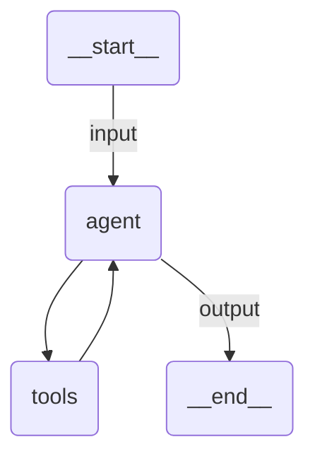

# UiPath Claude Agent SDK Template Agent

A quickstart UiPath Claude Agent SDK agent. It answers a weather question by calling one deterministic in-process tool and returns structured output.

> **Docs:** [Claude Agent SDK overview](https://docs.claude.com/en/api/agent-sdk/overview) **Samples:** [uipath-claude-sdk/samples](https://github.com/UiPath/uipath-integrations-python/tree/main/packages/uipath-claude-sdk/samples)

## What it does

1. **Validates the input** against the `WeatherRequest` model and renders the user message from the `prompt` template
2. **Runs the Claude Agent SDK loop**, which decides when to call the tool exposed by the in-process MCP server
3. **Returns structured output** validated against the `WeatherReport` model

### Tools

| Tool          | Description                                             |
| ------------- | ------------------------------------------------------- |
| `get_weather` | Returns a weather reading for a city (fixed sample data) |

The tool is defined with `@tool` and served in-process through `create_sdk_mcp_server`, so no external MCP process is needed.

Nothing is added to the agent beyond what `main.py` declares. This scaffold has no human-in-the-loop surface, and that is by design: suspending is opt-in. To add it, write a tool that calls `interrupt()` and register it with `uipath_tool_server`, as the [simple-hitl-agent sample](https://github.com/UiPath/uipath-integrations-python/tree/main/packages/uipath-claude-sdk/samples/simple-hitl-agent) does.

### Model

The agent is a `UiPathClaudeAgent`, and `uipath_llm=UiPathModel("claude-sonnet-4-5")` is the explicit opt-in that routes every model call through the UiPath LLM Gateway. On this path no Anthropic API key is needed, and the UiPath credentials written by `uipath auth` (`UIPATH_URL` and `UIPATH_ACCESS_TOKEN`) are used instead.

The id is a plain one. It is resolved against the tenant's model discovery at startup, so there is no need to know how the tenant hosts the model. To use a different model, change the id in `main.py`:

```python
agent = UiPathClaudeAgent(
    options=ClaudeAgentOptions(...),
    uipath_llm=UiPathModel("claude-sonnet-4-5"),
    ...
)
```

To call Anthropic directly instead, drop `uipath_llm`, set `ANTHROPIC_API_KEY`, and put the model id on the options as `ClaudeAgentOptions(model="claude-sonnet-4-5", ...)`. Nothing is injected on that path and the usage is billed to your Anthropic account.

## Agent graph



## Input / Output

`city` is the only input field the agent accepts.

```json
// Input
{
  "city": "London"
}

// Output
{
  "city": "London",
  "temperature_celsius": 14.0,
  "summary": "..."
}
```

## Running locally

```bash
# Authenticate and generate entry-points.json and bindings.json
uv run uipath auth
uv run uipath init

# Run with inline JSON
uv run uipath run agent '{"city": "London"}'

# Or with the bundled input file
uv run uipath run agent --file input.json --output-file output.json
```

## Evaluation

`evaluations/` holds one evaluation set and four evaluators. Three read the
tool calls out of the run's spans, so they check that the agent actually
consulted `get_weather` rather than answering from the model's own knowledge;
the fourth is an LLM judge over the returned `WeatherReport`.

```bash
uv run uipath eval
```

The tool the agent calls is exposed through an in-process MCP server, so its
name in the spans is `mcp__weather__get_weather` — the server key and the tool
name joined by the Claude Agent SDK, not the bare `get_weather`. Criteria in
`evaluations/evaluators/` are written against that full name.

The order evaluator is deliberately not strict: the runtime appends its own
`StructuredOutput` tool call after the agent's, to produce the typed output,
and a strict order would have to name that internal call to pass.

The judge calls the UiPath LLM gateway, so `uipath eval` needs a tenant whose
governance policy permits the model named in
`evaluations/evaluators/llm-judge-output.json`.

## Not yet supported

- Tool approval, meaning routing a tool call to a human for permission
- Interactive debugging
