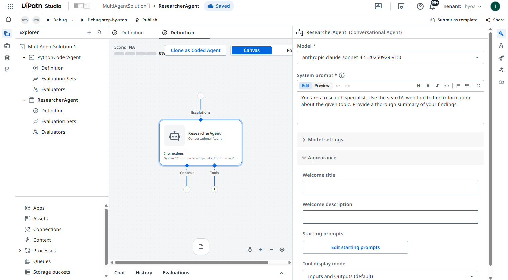

# Multi-Agent Remote (A2A) Sample

This sample demonstrates how to orchestrate **remote UiPath agents** via the [A2A protocol](https://google.github.io/A2A/) using Google ADK. A local coordinator agent delegates tasks to remote specialist agents hosted in UiPath, combining local orchestration with remote execution.

## Architecture

```
SequentialAgent (pipeline)
  +-- Agent (coordinator) ........... local, delegates to remote sub-agents
  |     +-- RemoteA2aAgent (research_agent) ... UiPath Studio Web agent
  |     +-- RemoteA2aAgent (code_agent) ....... UiPath Studio Web agent
  +-- Agent (formatter) ............. local, structures output as JSON
```

## Prerequisites

- [UiPath CLI](https://docs.uipath.com/cli) installed and configured
- Access to [UiPath Studio Web](https://cloud.uipath.com/)
- Python 3.10+

## Step 1: Create the Agents in UiPath Studio Web

Go to **UiPath Studio Web** and create a new solution (e.g. `MultiAgentSolution 1`) with two agents:



### ResearcherAgent (Conversational Agent)

- **Model:** `anthropic.claude-sonnet-4-5-20250929-v1:0` (or any supported model)
- **System prompt:**

```
You are a research specialist. Use the search_web tool to find information about the given topic. Provide a thorough summary of your findings.
```

### PythonCoderAgent (Conversational Agent)

- **Model:** any supported model
- **System prompt:**

```
You are a Python developer. Given a topic, write a short, practical Python code example that demonstrates or relates to the topic. Use the run_python tool to execute your code and verify it works. Return both the code and its output.
```

## Step 2: Deploy and Configure

1. **Publish** the solution from Studio Web
2. **Deploy** the solution to a folder in Orchestrator
3. Note down the **folder key** (from the folder URL) and the **release IDs** for each agent
4. Update [main.py](main.py) with your values:

```python
ORG_NAME = "YourOrgName"
TENANT_NAME = "YourTenantName"
RESEARCH_AGENT_FOLDER_KEY = "<your-folder-key>"
RESEARCH_AGENT_RELEASE_ID = "<your-release-id>"
CODE_AGENT_FOLDER_KEY = "<your-folder-key>"
CODE_AGENT_RELEASE_ID = "<your-release-id>"
```

## Step 3: Run

```bash
uipath auth
uipath dev web
```

This authenticates with UiPath Cloud and starts the local dev server with the ADK agent pipeline.
