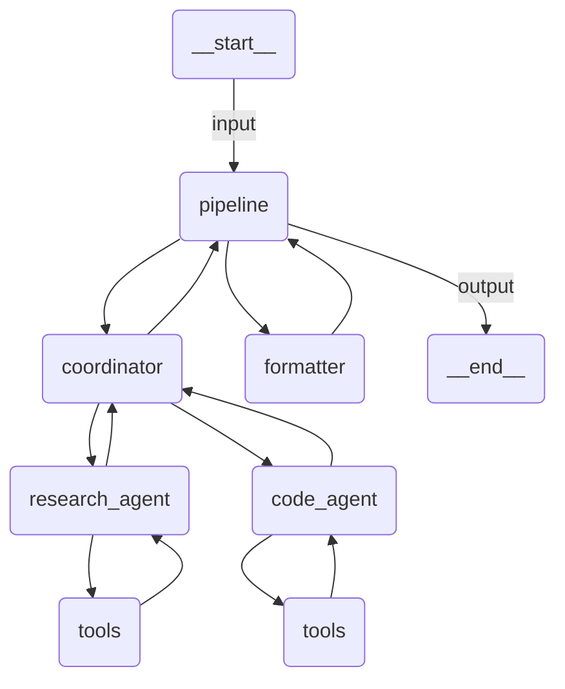

# Multi-Agent

A three-stage sequential agent that coordinates research (Wikipedia + Tavily), code generation, and structured report formatting.

## Agent Graph



## Run

```
uipath run agent '{"topic": "machine learning", "depth": "detailed"}'
```

## Debug

```
uipath dev web
```
