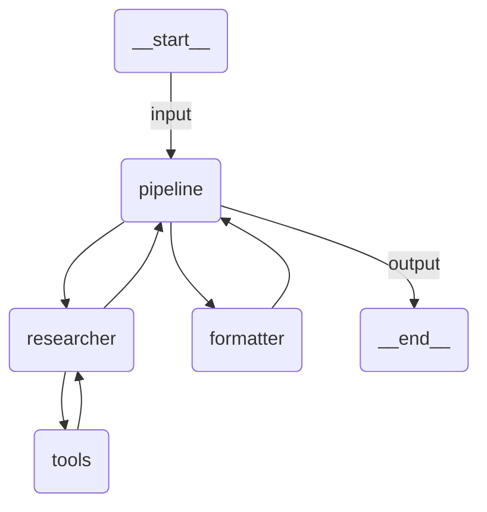

# Typed Agent

A two-stage sequential agent that researches a topic via Wikipedia and produces structured JSON output using the formatter pattern.

## Agent Graph



## Run

```
uipath run agent '{"topic": "artificial intelligence", "max_sources": 3, "language": "en"}'
```

## Debug

```
uipath dev web
```
