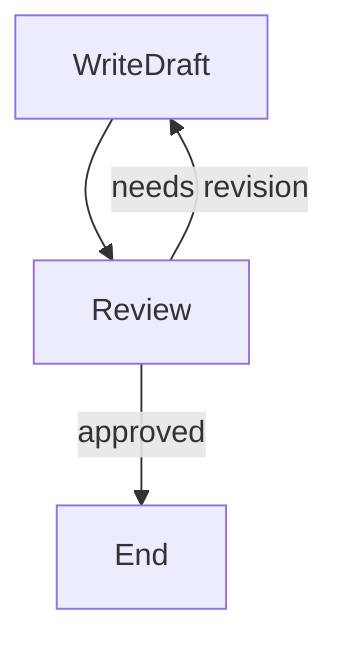
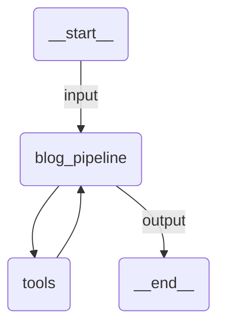

# Graph Flow

A blog post production pipeline using `pydantic-graph` for typed state machine control flow. A writer agent drafts a post, a reviewer agent evaluates it, and the graph loops until the post is approved or max revisions are reached.

Demonstrates:
- `BaseNode[StateT]` with return-type-driven edges
- `End[T]` for typed graph termination
- Agent message history in graph state for multi-turn refinement
- `Graph.run()` for complete graph execution

## Graph Structure



## Agent Graph



## Run

```
uipath run agent '{"messages": [{"contentParts": [{"data": {"inline": "Write a blog post about the future of AI agents"}}], "role": "user"}]}'
```

## Debug

```
uipath dev web
```
