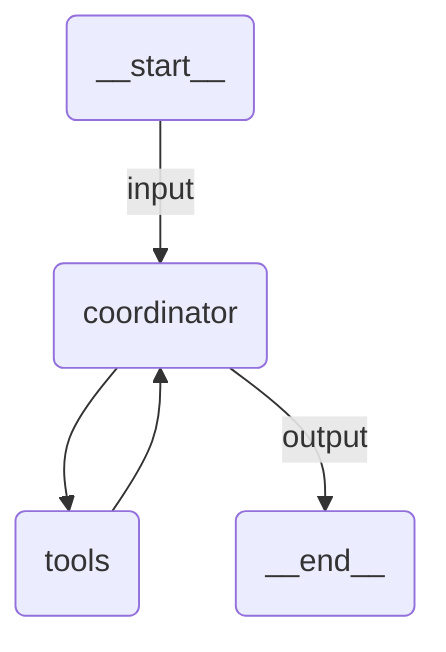

# Multi-Agent

A coordinator agent that delegates to specialist agents (researcher + code generator) via tool calls, then combines results into a structured report.

## Agent Graph



## Run

```
uipath run agent '{"messages": [{"contentParts": [{"data": {"inline": "Write a report about machine learning"}}], "role": "user"}]}'
```

## Debug

```
uipath dev web
```
