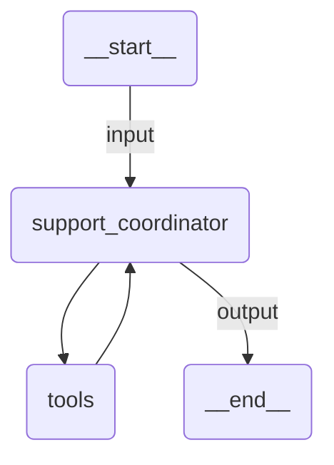

# Programmatic Hand-Off

A customer support pipeline where app code decides which specialist agent handles the request. A classifier agent categorizes the request, then the application routes to either a billing or technical specialist.

Demonstrates:
- Union output types (`ClassifiedRequest | Failed`) for flow control
- App-orchestrated routing (not LLM-decided)
- Shared `RunUsage` tracking across agents

## Agent Graph



## Run

```
uipath run agent '{"messages": [{"contentParts": [{"data": {"inline": "I was charged twice for my subscription last month"}}], "role": "user"}]}'
```

## Debug

```
uipath dev web
```
