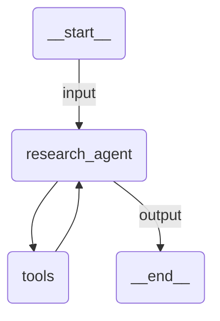

# Structured I/O

A research agent with strongly-typed input and output using Pydantic models. Demonstrates `deps_type` for structured input and `output_type` for structured output, with tools that access the input via `RunContext`.

## Agent Graph



## Run

```
uipath run agent '{"topic": "artificial intelligence", "max_sources": 3, "language": "en"}'
```

## Debug

```
uipath dev web
```
